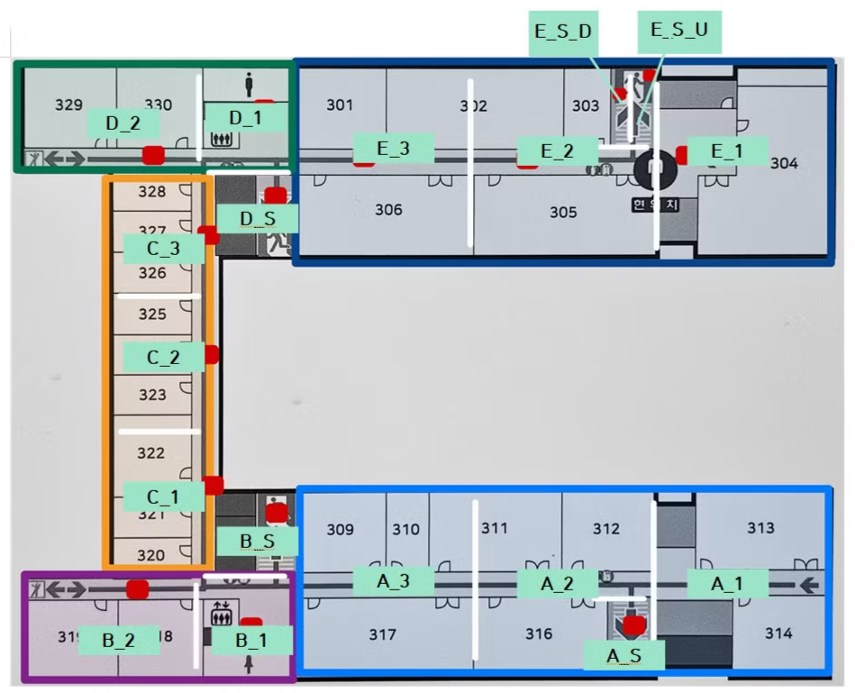

## Random Forest Model 1.

 

- 장소: 정보기술대학 7호관 3층
- 비콘 개수: 18개
- 구역 개수: 13개

### 데이터셋 구성

**[데이터 슬라이딩 윈도우 처리]**

- 5개의 연속된 데이터를 하나의 윈도우로 묶는다.
- 1개의 데이터씩 뒤로 이동하면서 윈도우를 형성한다.
- 별도의 파일에 각 윈도우를 저장한다.

```python
TimeStamp    B1  B2  B3  B4  B5  B6  B7  B8  B9  B10 B11 B12 B13 B14 B15 B16 B17 B18 Zone
2:42:41      0   0   0   0   0   0   0   0   0   0   0   0   0   0   0   0   -78  0   0   E_3
2:42:42      0   0   0   0   0   0  -70 -55  0   0   0   0   0   0   0   0    0   0   0   E_3
2:42:43      0   0   0   0   0   0  -73 -53  0   0   0   0   0   0  -83  0    0   0   0   E_3
2:42:44      0   0   0   0   0  -92 -71 -57  0  -88  0  -88  0   0   0   0    0   0   0   E_3
2:42:46      0   0   0   0   0   0   0   0   0   0   0  -90  0   0   0   0    0   0   0   E_3
```

**[데이터 분할]**

- 슬라이딩 윈도우로 처리된 데이터를 train과 val로 나누어 저장
- train : val = 80 : 20

**[윈도우 평균 값 계산 및 저장]**

- 각각의 윈도우 파일에서 비콘 데이터의 평균 값 계산
- 학습용 윈도우 데이터에 대해 평균 값을 계산하고 셔플 진행
- 평균 값 계산 시, 0은 평균 계산에 포함하지 않는다.

- 0은 NaN으로 처리
    
    ```python
    TimeStamp    B1  B2  B3  B4  B5  B6  B7  B8  B9  B10 B11 B12 B13 B14 B15 B16 B17 B18 Zone
    2:42:41      NaN NaN NaN NaN NaN NaN NaN NaN NaN NaN NaN NaN NaN NaN NaN NaN -78  NaN NaN E_3
    2:42:42      NaN NaN NaN NaN NaN NaN -70 -55 NaN NaN NaN NaN NaN NaN NaN NaN NaN NaN NaN E_3
    2:42:43      NaN NaN NaN NaN NaN NaN -73 -53 NaN NaN NaN NaN NaN NaN -83 NaN NaN NaN NaN E_3
    2:42:44      NaN NaN NaN NaN NaN -92 -71 -57 NaN -88 NaN -88 NaN NaN NaN NaN NaN NaN NaN E_3
    2:42:46      NaN NaN NaN NaN NaN NaN NaN NaN NaN NaN NaN -90 NaN NaN NaN NaN NaN NaN NaN E_3
    ```
    
- 유효한 값인 경우에만 평균에 활용
    
    ```python
    B1 mean = (NaN + NaN + NaN + NaN + NaN) = NaN → fill with 0
    B7 mean = (-70 + -73 + -71) / 3 = -71.33 → rounded to -71
    ...
    B17 mean = -78 / 1 = -78 (only non-NaN value)
    ```
    
- 최종 학습 데이터
    
    ```python
    TimeStamp    B1  B2  B3  B4  B5  B6  B7  B8  B9  B10 B11 B12 B13 B14 B15 B16 B17 B18 Zone
    2:42:41      0   0   0   0   0  -92 -71 -55  0  -88  0  -89  0   0   0   0   -78  0   E_3
    ```
    

### 모델 학습

- train과 val 데이터 파일 로드
- Label Encoding을 사용해 Zone 열을 숫자로 변환하여 사용
- RandomizedSearchCV를 이용해 하이퍼파라미터 튜닝 실행
    - 여러 하이퍼파라미터를 랜덤하게 선택하여 50번의 반복  진행

**[학습 및 검증 결과]**

```python
Best Parameters: {'n_estimators': 500, 'min_samples_split': 2, 'min_samples_leaf': 1, 'max_features': 'log2', 'max_depth': 30, 'bootstrap': False}
Validation Accuracy: 0.91
Classification Report:
              precision    recall  f1-score   support

         A_1       0.97      0.97      0.97        96
         A_2       0.93      0.89      0.91        95
         A_3       0.87      0.90      0.88        88
         B_1       0.91      0.90      0.90        87
         B_2       0.93      0.94      0.94        90
         C_1       0.94      0.98      0.96        83
         C_2       0.95      0.92      0.94        90
         C_3       0.94      0.94      0.94        78
         D_1       0.86      0.87      0.86        75
         D_2       0.89      0.92      0.91        79
         E_1       0.90      0.94      0.92        89
         E_2       0.83      0.85      0.84        75
         E_3       0.93      0.83      0.88        90

    accuracy                           0.91      1115
   macro avg       0.91      0.91      0.91      1115
weighted avg       0.91      0.91      0.91      1115

Optimized model and label encoder saved.
```

### 모델 테스트

**[정확도]**

```python
File: transformed_A_1_testdata.csv, Accuracy: 0.82
File: transformed_A_2_testdata.csv, Accuracy: 0.98
File: transformed_A_3_testdata.csv, Accuracy: 0.72
File: transformed_B_1_testdata.csv, Accuracy: 0.28
File: transformed_B_2_testdata.csv, Accuracy: 0.75
File: transformed_C_1_testdata.csv, Accuracy: 0.83
File: transformed_C_2_testdata.csv, Accuracy: 1.00
File: transformed_C_3_testdata.csv, Accuracy: 1.00
File: transformed_D_1_testdata.csv, Accuracy: 0.55
File: transformed_D_2_testdata.csv, Accuracy: 0.03
File: transformed_E_1_testdata.csv, Accuracy: 0.88
File: transformed_E_2_testdata.csv, Accuracy: 0.60
File: transformed_E_3_testdata.csv, Accuracy: 0.87
```
